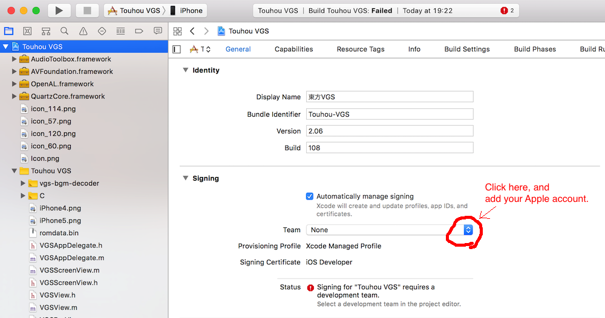

# iOSアプリ版 東方BGM on VGS

## ライセンス
[LICENSE.md](LICENSE.md)

## 起動方法
```
git clone https://github.com/suzukiplan/tohovgs-ios
cd tohovgs-ios
git submodule init
git submodule update
open Touhou\ VGS.xcodeproj
```

Terminalで上記手順を実行するとXCODEが起動します。
インストール先にデバイスまたはシミュレータを指定してビルドすれば起動できます。

> エラーが出て起動できない場合, XCODEにAppleアカウントが選択されていない可能性があります。
> プロジェクトのTARGETS ＞ General ＞ Signing から使用可能なAppleアカウントを追加して選択してください。
> 

